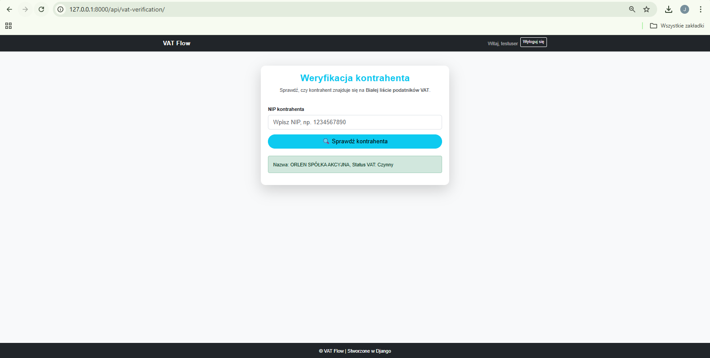

# VAT-flow: Simple VAT Management System with Cloud Storage

**VAT-flow**  is an user-friendly web application designed to ease the complexities of VAT accounting for small and medium-sized enterprises (SMEs) and accounting professionals. Developed with Python and Django, this provides a rapid VAT calculation tool that allows input and tracking of sales and purchase amounts subject to different VAT rates. The application ensures the automatic computation of VAT due or refundable, contains summary dashboards and reports (VAT registers), and validates vendors against the official VAT whitelist (utilizing an API with the Polish Ministry of Finance database). The VAT alert functionality proactively notifies users about upcoming VAT payment deadlines to help ensure timely compliance and avoid penalties. The application uses authentication mechanisms (such as SessionAuthentication or TokenAuthentication) provided by Django REST Framework to secure the API. Authentication ensures that any client—whether a mobile app, a web frontend, or an external application—must log in or provide a valid token to access or modify data through the API. By enabling authorization, the same API can be safely used by multiple types of frontends, each of which is required to authenticate before performing any actions.

## Technology Stack

- **Backend:** Python 3.x, Django 5.x, Django REST Framework
- **Frontend:** Bootstrap 5, HTML5, CSS3
- **Database:** PostgreSQL by default (SQLite for development)
- **Cloud Storage:** Amazon S3 for file storage and backups
- **Testing / CI:** Django’s built-in `unittest` framework via `django.test.TestCase`. The project follows Test-Driven Development (TDD) methodology by writing tests alongside or before implementing features. Tests can be run with Django’s test runner or with [pytest](https://pytest.org/) and the [pytest-django](https://pytest-django.readthedocs.io/) plugin for enhanced functionality.
- **Version Control:** Git and GitHub

## Features

- **Vendor VAT Whitelist Verification**: Automatically cross-check subcontractors and clients against Poland’s official VAT whitelist to ensure compliance and reduce financial risk.  
- **Sales and Purchase Ledger Management**: Efficiently track sales and purchase invoices with filtering, editing capabilities, and comprehensive data views.  
- **Simplified VAT Calculations**: Calculate VAT obligations and overpayments on demand for selected tax periods.  
- **VAT alert**: Reminds of the VAT payment deadline and indicates how many days are left until that date.  
- **Excel Export**: Export VAT registers and reports in Excel format to simplify accounting audits and data sharing.  
- **Responsive, Modern UI**: Built with Bootstrap 5 for a clean, responsive interface that works seamlessly across devices.  
- **Security & User Management**: Robust authentication and role-based access management to protect sensitive data. Authentication and authorization via the Django REST framework API ensure that only authenticated users with the proper roles can access or modify sensitive data. 
- **Full Test Coverage with TDD**: Comprehensive unit tests ensure system reliability and facilitate maintainability.  
- **Cloud Storage Integration**: All data, including exports and backups, are securely stored and managed on Amazon S3, enabling scalable, durable, and cost-effective cloud storage.

## Screenshots

Below are sample screenshots presenting the core features and UX of VAT-flow:

### Landing page View

### Dashboard View

### Profile Module

### Accounting Data Module

### Contractor's verification Module

### VAT Simulation Module

### DRF API endpoint

## Installation & Setup

Clone the repository and set up your local environment:

git clone [https://github.com/astepni/vat-flow-app.git](https://github.com/astepni/vat-flow-app.git)  
cd vat-flow-app  
python -m venv venv  
source venv/bin/activate # On Windows: .\venv\Scripts\activate  
pip install -r requirements.txt  
python manage.py migrate  
python manage.py runserver

Open your browser at `http://localhost:8000` to start using VAT-flow.

## Contribution Guidelines

Contributions are welcome! Please follow these guidelines:

- Fork the repository and create feature branches.
- Maintain code quality and write tests for new features.
- Use descriptive commit messages following [Conventional Commits](https://www.conventionalcommits.org).
- Submit pull requests for review.

## License

This project is licensed under the MIT License.

---

Elevate your VAT handling with VAT-flow: a tested, scalable, and cloud-integrated solution to simplify your financial workflows.

---
Contact / Support: 

If you encounter issues or have questions, please contact me via email: jogglepromotion@gmail.com
